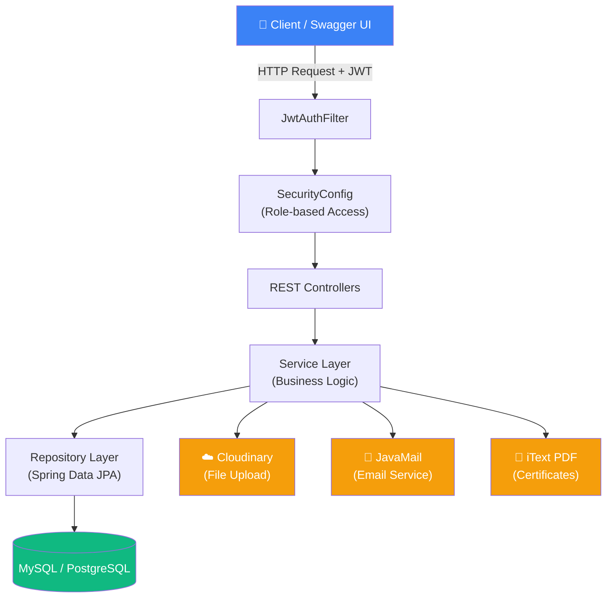
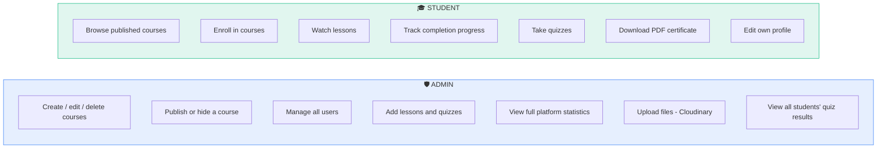
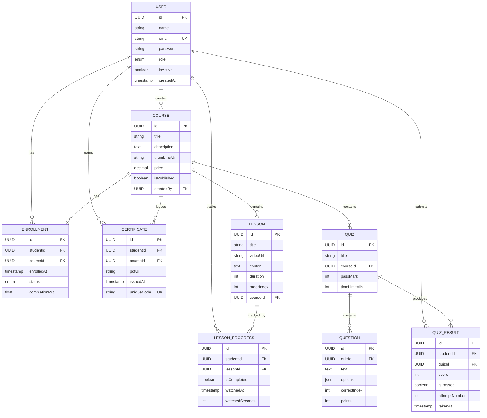
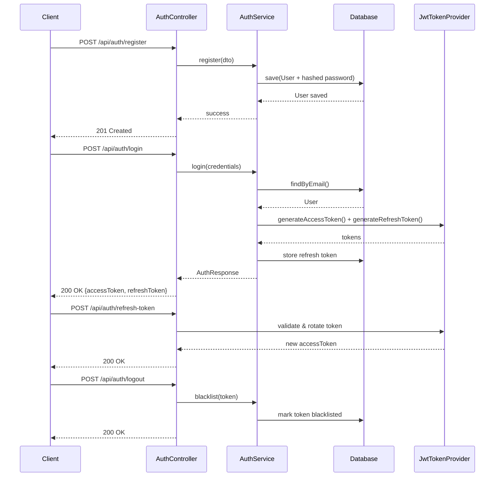
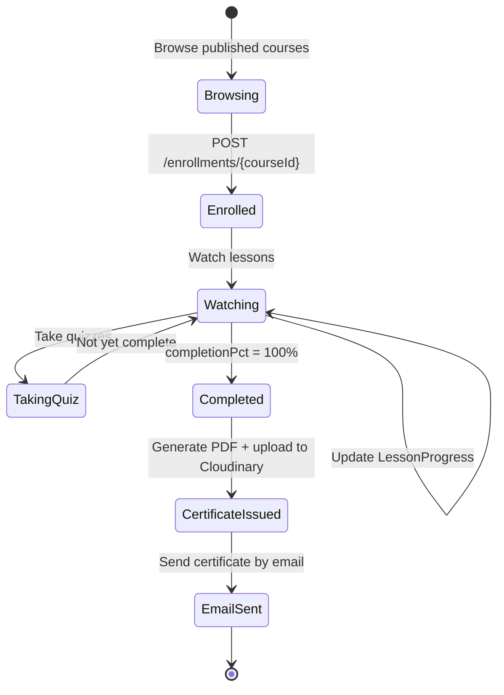

# 🎓 EduVault LMS

> A complete Learning Management System — REST API, No Front End

[](https://spring.io/projects/spring-boot)
[](https://www.oracle.com/java/)
[]()
[]()
[]()
[]()
[]()

---

## 📖 Overview

**EduVault LMS** is a complete REST API for an educational platform that supports:

| | |
|---|---|
| 🎯 **Goal** | Manage courses, enroll students, track progress, run quizzes, and auto-issue certificates |
| 👥 **Roles** | `ADMIN` controls all content and users, `STUDENT` interacts with content and tracks their own progress |
| 🔐 **Security** | JWT Authentication + Spring Security, every endpoint protected by role, refresh tokens + logout blacklist |
| 📄 **Documentation** | Swagger UI / OpenAPI 3 — auto-generated docs and in-browser API testing |

---

## 🧩 System Architecture



---

## 👥 Role-Based Permissions



---

## 🗄️ Database Schema (ERD)



---

## 🔐 Authentication Flow



---

## 🔄 Student Lifecycle (Enrollment → Certificate)



---

## 📡 API Endpoints

### 🔑 Auth
| Method | Endpoint | Access |
|---|---|---|
| `POST` | `/api/auth/register` | Public |
| `POST` | `/api/auth/login` | Public |
| `POST` | `/api/auth/refresh-token` | Public |
| `POST` | `/api/auth/logout` | Auth |

### 📚 Courses
| Method | Endpoint | Access |
|---|---|---|
| `GET` | `/api/courses` | Public |
| `GET` | `/api/courses/{id}` | Public |
| `POST` | `/api/courses` | Admin |
| `PUT` | `/api/courses/{id}` | Admin |
| `DELETE` | `/api/courses/{id}` | Admin |
| `PATCH` | `/api/courses/{id}/publish` | Admin |

### 🎬 Lessons
| Method | Endpoint | Access |
|---|---|---|
| `GET` | `/api/courses/{id}/lessons` | Student |
| `POST` | `/api/courses/{id}/lessons` | Admin |
| `PUT` | `/api/lessons/{id}` | Admin |
| `DELETE` | `/api/lessons/{id}` | Admin |
| `PATCH` | `/api/lessons/{id}/reorder` | Admin |

### 📋 Enrollments
| Method | Endpoint | Access |
|---|---|---|
| `POST` | `/api/enrollments/{courseId}` | Student |
| `GET` | `/api/enrollments/my` | Student |
| `DELETE` | `/api/enrollments/{courseId}` | Student |
| `GET` | `/api/enrollments/course/{id}` | Admin |

### 📈 Progress
| Method | Endpoint | Access |
|---|---|---|
| `POST` | `/api/progress/lessons/{id}/complete` | Student |
| `GET` | `/api/progress/courses/{id}` | Student |
| `GET` | `/api/progress/my` | Student |

### ❓ Quizzes
| Method | Endpoint | Access |
|---|---|---|
| `POST` | `/api/quizzes` | Admin |
| `GET` | `/api/quizzes/{id}` | Student |
| `POST` | `/api/quizzes/{id}/submit` | Student |
| `GET` | `/api/quizzes/{id}/results` | Student |
| `GET` | `/api/quizzes/{id}/all-results` | Admin |

### 🎖️ Certificates
| Method | Endpoint | Access |
|---|---|---|
| `GET` | `/api/certificates/my` | Student |
| `GET` | `/api/certificates/{id}/download` | Student |
| `GET` | `/api/certificates/verify/{code}` | Public |

### 📊 Admin Stats
| Method | Endpoint | Access |
|---|---|---|
| `GET` | `/api/admin/stats` | Admin |
| `GET` | `/api/admin/users` | Admin |
| `PATCH` | `/api/admin/users/{id}/toggle` | Admin |
| `GET` | `/api/admin/courses/stats` | Admin |

---

## 📁 Project Structure

```
eduvault-lms/
├── pom.xml
├── Dockerfile
├── docker-compose.yml
└── src/main/
    ├── resources/
    │   ├── application.yml
    │   └── application-prod.yml
    └── java/com/eduvault/lms/
        ├── EduVaultApplication.java
        │
        ├── config/                    # Spring configuration
        │   ├── SecurityConfig.java
        │   ├── JwtConfig.java
        │   ├── CloudinaryConfig.java
        │   └── SwaggerConfig.java
        │
        ├── security/                  # JWT + Filters
        │   ├── JwtTokenProvider.java
        │   ├── JwtAuthFilter.java
        │   └── UserDetailsServiceImpl.java
        │
        ├── model/                     # JPA Entities
        │   ├── User.java
        │   ├── Course.java
        │   ├── Lesson.java
        │   ├── Enrollment.java
        │   ├── LessonProgress.java
        │   ├── Quiz.java
        │   ├── Question.java
        │   ├── QuizResult.java
        │   └── Certificate.java
        │
        ├── enums/
        │   ├── Role.java              # ADMIN, STUDENT
        │   └── EnrollmentStatus.java
        │
        ├── repository/                # JPA Repositories
        │   ├── UserRepository.java
        │   ├── CourseRepository.java
        │   ├── LessonRepository.java
        │   ├── EnrollmentRepository.java
        │   ├── LessonProgressRepository.java
        │   ├── QuizRepository.java
        │   ├── QuizResultRepository.java
        │   └── CertificateRepository.java
        │
        ├── dto/
        │   ├── request/
        │   │   ├── RegisterRequest.java
        │   │   ├── LoginRequest.java
        │   │   ├── CourseRequest.java
        │   │   ├── LessonRequest.java
        │   │   └── QuizSubmitRequest.java
        │   └── response/
        │       ├── AuthResponse.java
        │       ├── CourseResponse.java
        │       ├── ProgressResponse.java
        │       ├── QuizResultResponse.java
        │       └── AdminStatsResponse.java
        │
        ├── service/                   # Business Logic
        │   ├── AuthService.java
        │   ├── CourseService.java
        │   ├── LessonService.java
        │   ├── EnrollmentService.java
        │   ├── ProgressService.java
        │   ├── QuizService.java
        │   ├── CertificateService.java
        │   ├── EmailService.java
        │   ├── FileUploadService.java
        │   └── AdminService.java
        │
        ├── controller/                # REST Controllers
        │   ├── AuthController.java
        │   ├── CourseController.java
        │   ├── LessonController.java
        │   ├── EnrollmentController.java
        │   ├── ProgressController.java
        │   ├── QuizController.java
        │   ├── CertificateController.java
        │   └── AdminController.java
        │
        └── exception/                 # Global Exception Handling
            ├── GlobalExceptionHandler.java
            ├── ResourceNotFoundException.java
            ├── UnauthorizedException.java
            └── AlreadyEnrolledException.java
```

---

## 🛠️ Tech Stack

| Technology | Purpose | Details |
|---|---|---|
| **Spring Boot** | Core framework | v6.x / Java 21 |
| **Spring Security** | Auth & authorization | JWT + BCrypt |
| **Spring Data JPA** | Database access | Hibernate ORM |
| **MySQL** | Primary database | v8.x / or PostgreSQL |
| **Swagger UI** | Auto-generated API docs | SpringDoc OpenAPI 3 |
| **Cloudinary** | File & image uploads | Java SDK |
| **JavaMail** | Sending emails | Spring Mail + Gmail |
| **iText PDF** | Certificate generation | v7.x |
| **MapStruct** | Entity → DTO mapping | v1.5.x |
| **Validation** | Input validation | Jakarta Bean Validation |
| **JUnit 5** | Unit testing | + Mockito |
| **Docker** | Deployment | + Docker Compose |

---

## 🔒 Security Design

| Element | Details |
|---|---|
| **JWT Secret** | Stored in `application.yml` (env variable) |
| **Access Token** | 15-minute validity |
| **Refresh Token** | 7-day validity — stored in DB |
| **Password Hashing** | `BCryptPasswordEncoder` (strength=12) |
| **Role Check** | `@PreAuthorize("hasRole('ADMIN')")` on every endpoint |
| **Logout** | Token blacklist stored in DB |
| **CORS** | Defined in `SecurityConfig` — allows all origins in dev |
| **Exception Handling** | `@RestControllerAdvice` via `GlobalExceptionHandler` |

---

## 🗺️ Build Roadmap


<details>
<summary><strong>📋 Step-by-step details</strong></summary>

1. **Project Setup** — Spring Initializr: add (Web, Security, JPA, Mail, Validation, MySQL Driver). Use Java 21 + Maven. Package name: `com.eduvault.lms`
2. **Database & Entities** — Create all entities with relationships (OneToMany, ManyToOne). Set `spring.jpa.hibernate.ddl-auto=update` initially.
3. **Auth System (JWT)** — Build `JwtTokenProvider` + `JwtAuthFilter` + `SecurityConfig`. Implement register and login endpoints and verify tokens work correctly.
4. **Course & Lesson CRUD** — Build `CourseController` + `CourseService` + `Repository`. Add `@PreAuthorize` to Admin endpoints. Link Lesson to Course with `orderIndex`.
5. **Enrollment System** — Prevent duplicate enrollment with a custom exception. Ensure a Student can only see lessons if enrolled. Auto-calculate `completionPct`.
6. **Progress Tracking** — Every time a Student finishes a lesson → create a `LessonProgress` record. Calculate completion: `(completedLessons / totalLessons) * 100`. At 100% → trigger certificate generation.
7. **Quiz System** — Admin creates a Quiz with questions. Student takes it and submits answers. Service auto-grades, saves the result, and returns `isPassed`.
8. **Certificate Generation** — Use iText to generate a PDF with student + course data. Upload it to Cloudinary. Send it by email via JavaMail. Generate a `uniqueCode` for verification.
9. **Admin Dashboard API** — Statistics: number of students, most enrolled course, completion rate, total quizzes. All via custom JPQL queries.
10. **Testing & Docker** — Write unit tests for services using Mockito. Add Swagger annotations. Create Dockerfile + docker-compose.yml with a MySQL container.

</details>

---

## 🚀 Quick Start

```bash
# Clone the repository
git clone https://github.com/<username>/eduvault-lms.git
cd eduvault-lms

# Run with Docker Compose
docker-compose up --build

# Or run locally with Maven
mvn spring-boot:run
```

Once running, the API documentation is available at:
```
http://localhost:8080/swagger-ui.html
```

---

## 📄 License

**© 2026 EduVault LMS — All Rights Reserved.**

This project is shared publicly for **viewing and demonstration purposes only**
(e.g., as part of a portfolio or educational showcase). No permission is
granted to copy, modify, distribute, deploy, or create derivative works from
this code without prior written consent from the copyright holder.

See the [`LICENSE`](./LICENSE) file for full terms.

---

<div align="center">

**EduVault LMS** · Spring Boot 6 · Java 21 · REST API · Back End Only

</div>
